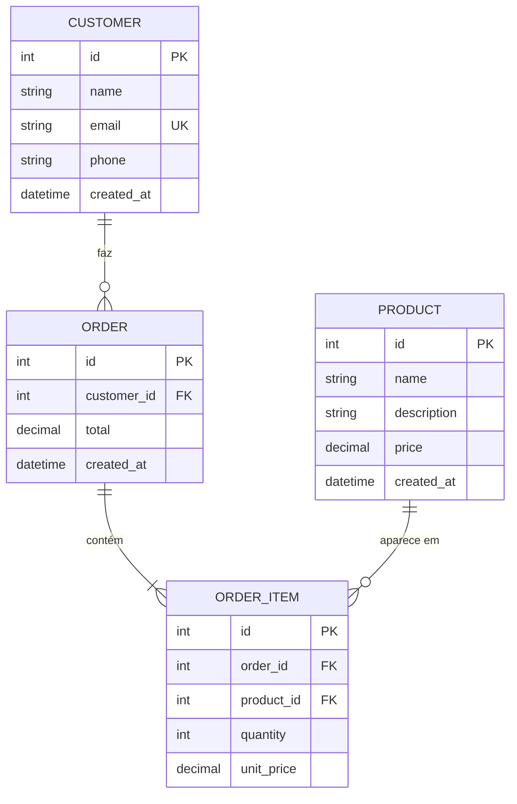

# Análise do Sistema — API da Loja "Armazém do Seu João"

> Este documento simula o **levantamento de requisitos** que normalmente é feito antes de escrever uma única linha de código. O objetivo é mostrar o caminho que vai do **problema real** até as **entidades, relacionamentos e endpoints** que serão implementados.

---

## 1. Contexto

O Seu João é dono de um pequeno armazém de bairro há mais de 20 anos. Durante esse tempo, ele sempre controlou tudo em um **caderno de capa dura**: os produtos em estoque, a lista de clientes fiéis (os "fiados") e as vendas do dia.

Nos últimos meses, o movimento cresceu bastante porque o armazém começou a aceitar pedidos por WhatsApp. O caderno, que antes dava conta, agora está virando um problema:

- O Seu João demora para achar o que um cliente já comprou no mês.
- Já aconteceu de vender um produto que estava em falta sem ele perceber.
- A filha dele, que ajuda no caixa, não consegue consultar o caderno enquanto ele está atendendo.
- No fim do mês, somar manualmente o total que cada cliente deve dá um trabalho enorme.

A filha do Seu João está no curso de Análise e Desenvolvimento de Sistemas e propôs construir uma **API REST** que centralize essas informações. No primeiro momento, a API servirá de base para um futuro aplicativo; agora, o foco é ter o **backend funcionando e testável**.

---

## 2. Problema a ser resolvido

Hoje, o Seu João **não tem uma fonte única de dados confiável** sobre:

1. Quais produtos existem no estoque e qual o preço atual de cada um.
2. Quem são os clientes cadastrados e como contatá-los.
3. Quais pedidos foram feitos, por quem, com quais produtos e em que quantidade.

A ausência dessas informações estruturadas gera **retrabalho, erros de estoque e perda de histórico de vendas**.

---

## 3. Objetivo do Sistema

Construir uma **API REST** capaz de:

- Cadastrar, consultar, atualizar e remover **produtos, clientes e pedidos**.
- Registrar quais produtos compõem cada pedido, com a **quantidade** vendida e o **preço praticado na venda** (importante: o preço do produto pode mudar depois, mas o histórico do pedido não deve mudar junto).
- Servir como base para uma futura interface web ou mobile.

---

## 4. Escopo

### Dentro do escopo (o que a API vai fazer)
- CRUD completo de **Produtos**.
- CRUD completo de **Clientes**.
- Criação e consulta de **Pedidos**, incluindo os itens do pedido.
- Listagem dos pedidos de um cliente específico.
- Cálculo automático do **valor total** do pedido a partir dos itens.
- Validação dos dados de entrada (formatos, campos obrigatórios, tipos).
- Tratamento padronizado de erros.

### Fora do escopo (o que **não** entra nesta versão)
- Autenticação e login de usuários.
- Controle financeiro / fluxo de caixa.
- Controle de estoque em tempo real (abatimento automático ao criar pedido).
- Relatórios gerenciais.
- Integração com WhatsApp ou gateway de pagamento.
- Interface visual (front-end).

> Deixar o escopo claro é tão importante quanto a lista do que **será** feito. Evita que o projeto cresça sem controle.

---

## 5. Stakeholders (pessoas interessadas no sistema)

| Stakeholder | Interesse principal |
|---|---|
| Seu João (dono) | Ter as informações do armazém centralizadas e acessíveis. |
| Filha do Seu João (operadora) | Registrar pedidos rapidamente sem depender do caderno. |
| Equipe de desenvolvimento (vocês) | Entregar uma API estável, bem estruturada e fácil de evoluir. |

---

## 6. Requisitos Funcionais (RF)

Requisitos funcionais descrevem **o que o sistema deve fazer**.

| Código | Descrição |
|---|---|
| RF01 | O sistema deve permitir **cadastrar** um produto com nome, descrição e preço. |
| RF02 | O sistema deve permitir **listar** todos os produtos cadastrados. |
| RF03 | O sistema deve permitir **buscar** um produto pelo seu identificador. |
| RF04 | O sistema deve permitir **atualizar** os dados de um produto. |
| RF05 | O sistema deve permitir **remover** um produto. |
| RF06 | O sistema deve permitir **cadastrar** um cliente com nome, e-mail e telefone. |
| RF07 | O sistema deve permitir **listar, buscar, atualizar e remover** clientes. |
| RF08 | O sistema deve permitir **criar um pedido** associado a um cliente existente, contendo **um ou mais produtos** e suas respectivas quantidades. |
| RF09 | O sistema deve **calcular automaticamente** o valor total do pedido no momento da criação. |
| RF10 | O sistema deve permitir **listar todos os pedidos**. |
| RF11 | O sistema deve permitir **consultar um pedido específico**, retornando seus itens detalhados (produto, quantidade, preço unitário no momento da venda, subtotal). |
| RF12 | O sistema deve permitir **listar os pedidos de um cliente específico**. |

---

## 7. Requisitos Não Funcionais (RNF)

Requisitos não funcionais descrevem **como** o sistema deve se comportar (qualidade, restrições técnicas).

| Código | Descrição |
|---|---|
| RNF01 | A API deve seguir o padrão **REST** e retornar respostas no formato **JSON**. |
| RNF02 | Todos os dados de entrada devem ser **validados** antes de chegar à camada de negócio. |
| RNF03 | Erros devem retornar **códigos HTTP apropriados** (400, 404, 409, 500) e uma mensagem legível. |
| RNF04 | O sistema deve usar **SQLite** como banco de dados, com o arquivo físico versionado fora do Git. |
| RNF05 | O código deve ser escrito em **TypeScript** e seguir uma arquitetura em camadas (Routes → Controller → Service → Repository). |
| RNF06 | A estrutura do banco deve estar descrita em um arquivo `schema.sql`, executável do zero. |

---

## 8. Regras de Negócio (RN)

Regras de negócio são **restrições e políticas** que o sistema precisa respeitar, geralmente vindas do mundo real (do negócio do Seu João), e não da tecnologia.

| Código | Regra |
|---|---|
| RN01 | O **e-mail do cliente é único** — não podem existir dois clientes com o mesmo e-mail. |
| RN02 | O **preço do produto** deve ser sempre **maior que zero**. |
| RN03 | Um pedido deve ter **pelo menos um item**. |
| RN04 | A **quantidade** de cada item do pedido deve ser um **inteiro maior que zero**. |
| RN05 | O **preço unitário registrado no item do pedido** é o preço que o produto tinha **no momento da venda**. Se o preço do produto mudar depois, o pedido antigo **não muda**. |
| RN06 | Não é possível **remover um cliente que tenha pedidos registrados** (ele tem histórico). |
| RN07 | Não é possível **remover um produto que esteja em algum pedido** (quebraria o histórico). |

> As regras de negócio são o que **diferencia um sistema do outro**. Duas APIs podem ter os mesmos requisitos funcionais, mas regras diferentes — e é isso que define o comportamento real.

---

## 9. Entidades Identificadas

A partir dos requisitos, conseguimos identificar **três entidades principais** e uma **tabela associativa** (que aparece por causa do relacionamento N:N).

### 9.1. Customer (Cliente)
Representa uma pessoa que compra no armazém.

| Atributo | Tipo | Restrições |
|---|---|---|
| `id` | inteiro | PK, auto-incremento |
| `name` | texto | obrigatório |
| `email` | texto | obrigatório, único |
| `phone` | texto | opcional |
| `created_at` | data/hora | preenchido automaticamente |

### 9.2. Product (Produto)
Representa um item disponível para venda.

| Atributo | Tipo | Restrições |
|---|---|---|
| `id` | inteiro | PK, auto-incremento |
| `name` | texto | obrigatório |
| `description` | texto | opcional |
| `price` | decimal | obrigatório, > 0 |
| `created_at` | data/hora | preenchido automaticamente |

### 9.3. Order (Pedido)
Representa uma venda feita para um cliente.

| Atributo | Tipo | Restrições |
|---|---|---|
| `id` | inteiro | PK, auto-incremento |
| `customer_id` | inteiro | FK → Customer, obrigatório |
| `total` | decimal | calculado a partir dos itens |
| `created_at` | data/hora | preenchido automaticamente |

### 9.4. OrderItem (Item de Pedido) — tabela associativa
Surge do relacionamento **N:N** entre `Order` e `Product`. Não é uma simples tabela de ligação: ela carrega **atributos próprios** (quantidade e preço unitário no momento da venda).

| Atributo | Tipo | Restrições |
|---|---|---|
| `id` | inteiro | PK, auto-incremento |
| `order_id` | inteiro | FK → Order, obrigatório |
| `product_id` | inteiro | FK → Product, obrigatório |
| `quantity` | inteiro | obrigatório, > 0 |
| `unit_price` | decimal | obrigatório, preço praticado na venda |

---

## 10. Relacionamentos

- Um **Cliente** pode ter **muitos Pedidos** → relacionamento **1:N**.
- Um **Pedido** pode conter **muitos Produtos**, e um **Produto** pode aparecer em **muitos Pedidos** → relacionamento **N:N**, resolvido pela tabela `OrderItem`.

### Diagrama Entidade-Relacionamento (ER)

> **Por que a tabela `OrderItem` existe?**
> Porque o relacionamento entre `Order` e `Product` **não é simples**: precisamos guardar **quantos** de cada produto foram comprados e **por qual preço**. Sempre que um relacionamento N:N precisa de dados próprios, ele vira uma tabela com identidade.

---

## 11. Histórias de Usuário

Histórias de usuário são uma forma simples de descrever funcionalidades pela ótica de quem usa o sistema. Formato:
> **Como** \<papel\>, **quero** \<ação\>, **para** \<benefício\>.

| # | História |
|---|---|
| H01 | Como dono do armazém, quero **cadastrar um novo produto** para que ele fique disponível para venda. |
| H02 | Como dono do armazém, quero **atualizar o preço de um produto** porque os preços mudam com o tempo. |
| H03 | Como operadora, quero **cadastrar um novo cliente** para registrar pedidos dele no futuro. |
| H04 | Como operadora, quero **criar um pedido** escolhendo o cliente e os produtos, para registrar a venda. |
| H05 | Como dono do armazém, quero **ver todos os pedidos de um cliente** para saber seu histórico de compras. |
| H06 | Como dono do armazém, quero **consultar um pedido específico** para ver exatamente o que foi vendido e por qual preço. |

---

## 12. Contrato dos Endpoints (visão geral)

Abaixo estão os endpoints que **serão implementados**. A especificação detalhada de corpo de requisição e resposta está no `README.md`.

| Método | Rota | O que faz |
|---|---|---|
| `GET`    | `/products`              | Lista todos os produtos |
| `GET`    | `/products/:id`          | Busca um produto pelo id |
| `POST`   | `/products`              | Cria um novo produto |
| `PUT`    | `/products/:id`          | Atualiza um produto |
| `DELETE` | `/products/:id`          | Remove um produto |
| `GET`    | `/customers`             | Lista todos os clientes |
| `GET`    | `/customers/:id`         | Busca um cliente pelo id |
| `POST`   | `/customers`             | Cria um novo cliente |
| `PUT`    | `/customers/:id`         | Atualiza um cliente |
| `DELETE` | `/customers/:id`         | Remove um cliente |
| `GET`    | `/customers/:id/orders`  | Lista pedidos de um cliente |
| `GET`    | `/orders`                | Lista todos os pedidos |
| `GET`    | `/orders/:id`            | Busca um pedido pelo id (com itens) |
| `POST`   | `/orders`                | Cria um novo pedido |

> **Por que não há `PUT /orders/:id` nem `DELETE /orders/:id`?**
> Pedidos representam um **fato histórico** (uma venda aconteceu). Alterar ou apagar um pedido reescreve a história. Em sistemas reais, isso normalmente é resolvido com **cancelamento** (uma flag ou um novo registro de estorno), não com `DELETE`. Para manter o projeto simples e didático, deixamos `UPDATE`/`DELETE` de pedidos **fora do escopo**.

---

## 13. Decisões Técnicas e Justificativas

| Decisão | Justificativa |
|---|---|
| **TypeScript** em vez de JavaScript puro | Tipagem ajuda o aluno a entender contratos entre camadas e pega erros antes de rodar o código. |
| **SQLite** sem ORM | Permite que o aluno veja o SQL de verdade e entenda o padrão Repository sem mágica escondida. |
| **Express** como framework HTTP | Simples, maduro, muita documentação — ideal para quem está começando. |
| **Zod** para validação | API declarativa, integração natural com TypeScript (infere tipos a partir do schema). |
| **Arquitetura em camadas** (Routes → Controller → Service → Repository) | Separa responsabilidades: cada camada tem um único motivo para mudar, o código fica testável e organizado. |
| **Sem autenticação nesta fase** | O foco pedagógico é arquitetura e CRUD. Autenticação entra em um momento posterior. |

---

## 14. Próximos passos após a Análise

Com a análise concluída, o fluxo de trabalho é:

1. Criar o **schema do banco** a partir das entidades identificadas (seção 9).
2. Construir as **camadas de cada entidade**, começando pela mais simples (sem dependências): **Product → Customer → Order**.
3. Implementar os **endpoints** (seção 12) sempre da camada mais interna para a mais externa: **Repository → Service → Controller → Routes**.
4. Testar com o arquivo `requests.http`.

O passo a passo de implementação está no **[README.md](README.md)**.
